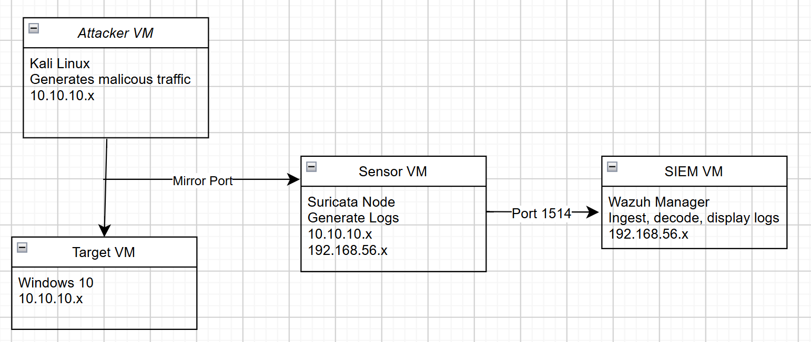
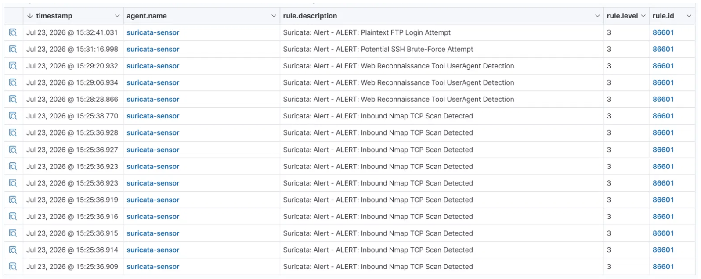
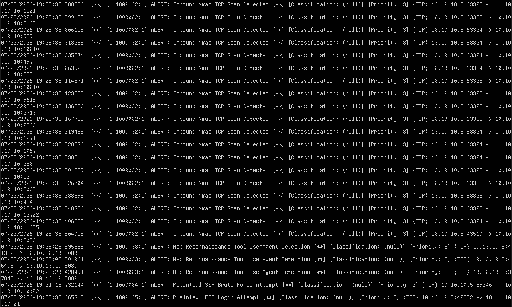

# Enterprise Threat Detection & Telemetry Pipeline

A fully isolated, multi-VM home lab simulating a realistic attack chain, detected 
end-to-end using a custom Suricata IDS deployment and a Wazuh SIEM.

## Overview

This project builds and validates a detection engineering pipeline: an attacker 
machine generates traffic against a target host, a Suricata sensor passively 
inspects that traffic via a mirrored network tap, and a Wazuh SIEM ingests, 
decodes, and displays the resulting alerts on a centralized dashboard.

To validate the pipeline, I simulated a four-stage attack chain reconnaissance, 
web enumeration, SSH brute-force, and plaintext credential harvesting and 
confirmed each stage was detected in near real-time, from the network wire to 
the SIEM dashboard.

📄 **[Full Incident Report](./docs/incident-report.md):** includes technical 
analysis, detection engineering rationale, business impact assessment, and 
recommendations.

## Architecture



The lab uses two isolated network segments:
- **Malware Range** (10.10.10.x): isolated network with no internet access, 
  containing the attacker and target VMs
- **Management Network** (192.168.56.x): connects the sensor and SIEM for 
  log forwarding and dashboard access

## Tech Stack

- **Virtualization:** VirtualBox (multi-VM, Host-Only + Internal Network adapters)
- **Attacker:** Kali Linux
- **Target:** Windows 10
- **IDS:** Suricata (custom rule set, passive network tap)
- **SIEM:** Wazuh (Indexer, Manager, Dashboard)  v4.14
- **OS (Sensor/SIEM):** Ubuntu Server 25.04

## What This Demonstrates

- Multi-VM network segmentation and isolation for safe attack simulation
- Custom Suricata rule writing (5 signatures) with false-positive tuning
- End-to-end SIEM log pipeline: Suricata → Wazuh agent → Manager → Dashboard
- Real-world Linux systems troubleshooting (LVM disk resizing, DNS 
  misconfiguration, GPG/package management, broken dpkg states)
- Professional incident response documentation

## Key Screenshots

**Attack chain alerts in the Wazuh Dashboard:**


**Suricata detecting live traffic on the wire:**


## Custom Detection Rules

All 5 custom Suricata signatures are in [`suricata/local.rules`](./suricata/local.rules):

| SID | Detects |
|---|---|
| 1000001 | ICMPv4 Echo Request (Ping) |
| 1000002 | Inbound Nmap TCP SYN Scan |
| 1000003 | Web Reconnaissance Tool User-Agent |
| 1000004 | SSH Brute-Force Attempt |
| 1000005 | Plaintext FTP Login Attempt |

## Challenges & Lessons Learned

Building this lab surfaced several real infrastructure issues, each requiring 
independent diagnosis and resolution:

- **Disk space starvation masquerading as package failures:** 
repeated Wazuh dashboard install failures were ultimately traced to an LVM logical 
  volume that had never been extended to use the full virtual disk, silently 
  causing `dpkg` write failures.
- **DNS resolution instability:** VirtualBox's NAT Network was passing 
  through an unreliable upstream DNS server, causing intermittent `apt` 
  failures; resolved by pinning static DNS servers via netplan.
- **GPG keyring format incompatibility:** a modern `gpg --import` produced a 
  keybox format `apt` couldn't read, silently breaking repository signature 
  verification; resolved using `gpg --dearmor` with an explicit `signed-by` 
  reference.
- **Broken dpkg maintainer scripts:** partial installs left behind `prerm`/
  `postrm` scripts referencing already-deleted files, requiring manual 
  intervention to fully clean the package database.

These issues reflect the kind of layered troubleshooting — network, package 
management, and storage — required in real infrastructure and security 
engineering work, beyond simply following setup documentation.

## Project Structure

```
enterprise-threat-detection-lab/
├── README.md
├── docs/
│   ├── incident-report.md
│   └── architecture-diagram.png
├── suricata/
│   └── local.rules
└── screenshots/
```