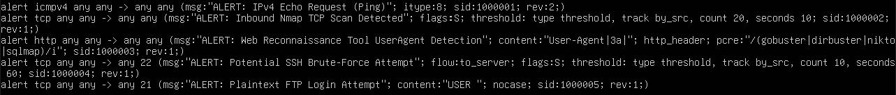

# SIEM Write-Up 

## 1\. Executive Summary

In this lab, I simulated a four-stage attack chain. Utilizing reconnaissance and enumeration to gather information, exploiting the system through brute force attacks, and gathering data through credential harvesting. The real-world consequence if undetected would include credential exposure as well as regulatory and reputational risks. The attack was detected in real time across all four stages and displayed in the SIEM dashboard. There was no actual compromise, and the exercise validated that the detection pipeline works end-to-end from network traffic to actionable alert.

## 2\. Environment Overview

The lab architecture consisted of four virtual machines: a SIEM, a sensor, a target system, and an attack system, all using Oracle VirtualBox. The SIEM used a Wazuh Manager/Indexer/Dashboard for its software. The sensor used Suricata, with a passive tap on an isolated network. Both the SIEM and sensor VM’s ran Ubuntu Server for their OS. The target system ran Windows 10 OS, and the attacker ran Kali Linux. This lab was conducted in a controlled, isolated test environment.

## 3\. Incident Timeline

| Time (UTC) | Stage | Technique | Suricata Rule Triggered |
| :---- | :---- | :---- | :---- |
| Jul 23, 2026 @ 15:25:34.767 \- 15:25:38.770 | Recon | Nmap SYN scan | sid:1000002 |
| Jul 23, 2026 @ 15:28:28.866 \- 15:29:20.932 | Web Enumeration | Gobuster-style User-agent | sid:1000003 |
| Jul 23, 2026 @ 15:31:16.998 | Credential Access | SSH brute-force attempt | sid:1000004 |
| Jul 23, 2026 @ 15:32:41.031 | Exfiltration/Credential Harvesting | Plaintext FTP login | sid:1000005 |

## 4\. Technical Analysis 

### Stage 1: Network Reconnaissance (Nmap SYN Scan)

The attacker began with a simulated TCP SYN scan (nmap \-sS \-sV \-Pn) against the target host, a common first step used to identify open ports and running services on a network before deciding how to proceed with an attack.

This activity was detected by a custom Suricata signature (sid:1000002) configured to alert on TCP SYN packets received without a completed handshake. To avoid false positives from normal connection attempts, the rule applies a threshold condition, triggering only when a single source IP initiates 20 or more SYN packets within a 10-second window, which is a pattern consistent with automated port scanning.

All of the alerts were logged to Suricata's eve.json output, forwarded by the Wazuh agent, and appeared in the Wazuh dashboard within seconds, confirming end-to-end detection from the wire to the SIEM.

### Stage 2: Web Enumeration

Following the initial scan, the attacker simulated web directory enumeration against an HTTP service running on the target (port 8080), and sent multiple requests using a User-Agent string associated with the tool Gobuster (e.g., curl \-A "gobuster/3.1" http://10.10.10.10:8080/admin). This technique mimics an attacker probing for hidden endpoints or administrative panels ahead of a more sophisticated attack.

This activity was detected by a custom Suricata signature (sid:1000003) configured to inspect and alert on HTTP packets that are received and contain predefined User-Agent strings in their header that match known reconnaissance tool signatures, including Gobuster, Dirbuster, Nikto, and Sqlmap. It also contains a case-insensitive flag to ensure detection regardless of the casing.

As with the initial scan, the alert was forwarded from Suricata to the Wazuh Manager via the deployed agent and appeared in the dashboard as rule ID 86601, with three separate alerts logged corresponding to each enumeration attempt.

### Stage 3: SSH Brute-Force Attempt

After the web reconnaissance, the attacker pivoted to a simulated brute-force attack against the target’s SSH service (port 22). This simulates an attacker attempting to gain unauthorized access to the target via repeated connection attempts. 

This activity was detected by a custom Suricata signature (sid:1000004) designed to identify multiple TCP SYN packets directed to port 22\. The rule limits alerts to triggering only when a single source IP (tracked by by\_src) attempts 10 or more TCP SYN handshakes within a 60-second window, a pattern consistent with automated brute-force attempts.

The deployed agent forwarded the Suricata alert to the Wazuh Manager, where it was logged as rule ID 86601\.

### Stage 4: Plaintext Credential Harvesting (FTP)

The final stage of the simulated attack targeted the legacy File Transfer Protocol (FTP). The attacker sent an FTP login command (USER admin) to the target, which is an attempt to capture credentials transmitted over an insecure, unencrypted protocol. 

This activity was detected by a custom Suricata signature (sid:100005) created to alert on any match on the literal FTP USER command as it appears in unencrypted TCP traffic. With this, the alert will only fire on login attempts, not on general traffic from other FTP sessions. The rule also ignores case sensitivity for the command string. Since FTP transmits credentials in cleartext, any attacker who can observe network traffic could intercept valid login credentials in transit. 

This alert was likewise ingested by Wazuh and appeared as rule ID 86601\.

## 5\. Detection Engineering Rationale

Rather than using the community rule set, the Suricata sensor used custom rules written specifically for this lab. The reason is that by defining my own rules, I was able to understand what each rule did and the traffic that would trigger the rule to generate an alert. By doing this, I kept the SIEM dashboard full of only meaningful alerts in the scope of the lab.

Since I am writing the rules, I can edit and tune each rule to reduce the false positives. For example, the initial ICMP(sid:1000001) rule was written broadly, matching any incoming ICMP traffic. During the test, the rule generated a high volume of alerts unrelated to the intended test. The traffic alerted on by the rule was background IPv6 multicast messages such as Neighbour Discovery. Because Suricata’s ‘icmp’ keyword matches both ICMPv4 and ICMPv6 traffic, the rule flagged normal traffic as suspicious activity. The rule was changed to match ICMPv4, with the explicit ‘itype:8’ for echo requests only. This eliminated false positives while maintaining the detection of the intended traffic.

Some of the rules used threshold-based detection, where a rule would only trigger an alert if the number of packets matching hit the predefined threshold. Without this, a single packet from the normal constant traffic would trigger the rule creating a flood of false alerts. The rules that included thresholds were for SSH(sid:1000004) to detect brute forcing and Nmap(sid:1000002) to detect port scanning; their threshold values were 10 and 20, respectively. Both of these rules match against SYN packets on different ports, which are a part of non-suspicious traffic. Since every connection attempt uses them, these packets are valid most of the time. Hitting the threshold represents a rate of connection commonly caused by scripted or automated tooling, not by human behaviour. But there is a trade-off when using thresholds: if the threshold is too high, you risk the possibility of missing a real attack if it happens too quickly. If the threshold is too low, alert fatigue becomes the norm, and writing off valid alerts becomes an issue. 

## 6\. Business Impact Assessment (the "if this were real" section)

Although this was a controlled simulation, each stage mirrors the techniques used in actual intrusion attempts, and none of the alerts block anything. The sensor operated in a passive monitoring-only capacity, listening to incoming traffic without interfering with it. 

Each stage represents a different phase in a plausible attack chain. With each stage building on the previous if gone undetected, this would have progressed from a network scan to actual unauthorized access and credential theft. 

If the full chain had gone undetected and succeeded, the consequences could have included unauthorized access to internal systems via brute-forced SSH credentials, exposure of valid login credentials transmitted in cleartext over FTP, and potential regulatory or compliance exposure if those credentials belonged to systems handling sensitive or regulated data. Depending on the systems and data involved an organization could also face reputational damage and loss of customer trust if a compromise like this went public. 

If these events and intrusion attempts were actually made, Suricata adn Wazuh is able to detected every stage of the attack in almost real time. In a live environment, a SOC analyst monitoring the dashboard would have been alerted to the suspicious activity long before the final stage completed. Intervening before any lasting damage happened to the systems.

## 7\. Response & Mitigation

	  
In this lab, Suricata and Wazuh operated in a purely detective mode. Suricata passively listened and inspected traffic via a mirrored network tap, matching predefined custom signatures to detect suspicious traffic and generate alerts. These alerts are sent to the Wazuh SIEM, which then ingests, decodes, and displays the alerts in a centralized dashboard. The system never automatically blocked traffic, terminated connections or took any corrective action. Every alert generated required manual review to act on. This reflects the scope of the lab, which focused on building a reliable detection system and pipeline rather than an automated response system.

Upon seeing alerts on a dashboard for a real production server, the SOC analyst monitoring and responsible for the dashboard would first ensure that the alert is not a false positive. After confirming the alert validity, they would move to contain the incident so it wouldn’t affect other production servers, taking action such as isolating the affected host from the network or blocking the source IP at the firewall. From there, the analyst would eradicate the intrusion attempt, then restore the affected server to a known good state, before finally documenting the incident in a formal report for the organization’s records and future reference. 

## 8\. Recommendations / Next Steps

* Implement automated response and mitigation. The current pipeline is detection only. The next step is to configure Wazuh’s automatic active response module to block source IP addresses.  
* Establish a traffic baseline before deploying rules and thresholds in production. By first observing normal traffic patterns, I can set the rules and thresholds based on what “normal” actually looks like, rather than discovering false positives reactively.    
* Expand the custom rules set to cover additional techniques. The current rule list is small and only covers a limited range of attack techniques. Expanding the rule set to detect other common or severe techniques is a logical next step.  
* Installing host-based telemetry. The lab focuses on network-layer visibility through Suricata. Adding host-based telemetry from the target machine would allow correlation between network alerts and endpoint activity, giving analysts a more complete picture of an attack.

## 9\. Appendix 

### Appendix A: Lab Architecture Diagram 

### Appendix B: Custom Suricata Rule Set 

### Appendix C: Wazuh Dashboard; Attack Chain Alerts 

